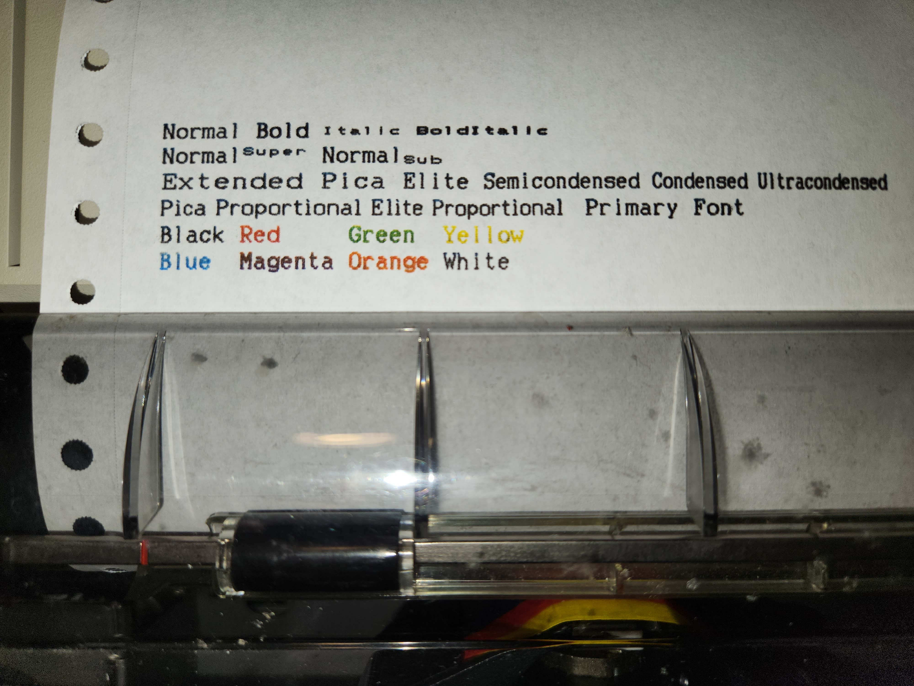

ansi2iwii
=========

Tool to convert ANSI escape sequences to those compatible with the Apple
ImageWriter II.

Example
-------

Example of a printout generated using `test.sh` and a color ribbon:


Supported ANSI Escape Codes
---------------------------

Currently only a subset of SGR (Screen Graphic Rendition) ANSI escape sequences
(following the form of `ESC[<num>[...]m`) are supported:

| SGR   | Description               | IWII        | Notes                                                 |
|-------|---------------------------|-------------|-------------------------------------------------------|
| 0     | Reset                     | (multiple)  |                                                       |
| 1     | Bold                      | `ESC !`     |                                                       |
| 3     | Italic                    | `ESC w`     | Approximating using half height text on the IWII side |
| 4     | Underline                 | `ESC X`     |                                                       |
| 8     | Conceal                   | N/A         | Prints spaces while enabled                           |
| 9     | Strikethrough             | `\b-`       | Prints - over each character (slow)                   |
| 10    | Primary Font              | (multiple)  | Set via `--font`, defaults to Elite                   |
| 11-19 | Set Font                  | (multiple)  | See `--help` for details                              |
| 22    | Normal Intensity/Bold Off | `ESC "`     |                                                       |
| 23    | Italic Off                | `ESC W`     | See note on 3                                         |
| 24    | Underline Off             | `ESC Y`     |                                                       |
| 26    | Proportional Spacing      | (multiple)  | Sets font to pica/elite proportional                  |
| 28    | Conceal Off               | N/A         |                                                       |
| 29    | Strikethrough Off         | N/A         |                                                       |
| 30-37 | Set Foreground Color      | (multiple)  | Cyan (6) represented by orange                        |
| 50    | Proportional Spacing Off  | (multiple)  |                                                       |
| 73    | Superscript               | `ESC x`     |                                                       |
| 74    | Subscript                 | `ESC y`     |                                                       |
| 75    | Superscript/Subscript Off | `ESC z`     |                                                       |

Additional ImageWriter II escape codes are supported through command-line options.

Usage
-----

The main intended use of `ansi2iwii` is to be used as an intermediate program
between a program generating text, and the printer's serial port. e.g.:

```
... | ansi2iwii -o /dev/ttyUSB0
```

```
$ ./ansi2iwii --help
ansi2iwii: Convert ANSI escape codes to Apple ImageWriter II escape codes

Basic Options:
  -i, --input=FILE          Read input from FILE, use `-` for stdin (default)
  -o, --output=FILE         Write output to FILE, use `-` for stdout (default)
  -b, --baud=RATE           Set baud rate to use when output is set to the printer's serial
                            port. Values 300, 1200, 2400, and 9600 (default) are accepted
  -F, --flow=MODE           Set flow control mode when using serial as output
                              0: None
                              1: XON/XOFF (default)
                              2: RTS/CTS
  -N, --no-setup            Do not configure printer via escape codes on startup

Common Format Options:
  -f, --font=FONT           Set default font to use:
                              0: Extended
                              1: Pica
                              2: Elite (default)
                              3: Semicondensed
                              4: Condensed
                              5: Ultracondensed
                              6: Pica proportional
                              7: Elite proportional
                              8: Custom
  -q, --quality=QUAL        Set print quality to use:
                              0: Draft (default)
                              1: Standard
                              2: Near Letter Quality
  -c, --color[=COLOR]       Enable support for color, set default color if supplied.
                              0: Black (default)
                              1: Red
                              2: Green
                              3: Yellow
                              4: Blue
                              5: Purple
                              6: Orange
  -t, --tab=WIDTH           Set tab width, in characters (default is 8)
                            NOTE: Tab positions are relative to the starting font
  -l, --lpi=LPI             Set number of lines per inch, 6 (default) or 8
  -L, --line-spacing=SPACE  Set spacing between lines, in 144ths of an inch (1-99)

Page Settings:
  -M, --left-margin=MARGIN     Set left margin in characters
  -p, --pagelen=LENGTH         Set page length in 144ths of an inch
  -P, --skip-perforation[=EN]  Enable/disable continuous-form perforation skip

Misc. Print Settings:
  -U, --unidirectional[=EN]    Enable/disable unidirectional printing
  -A, --auto-linefeed[=EN]     Enable/disable automatic linefeed at end of line
  -Z, --slashed-zero[=EN]      Enable/disable slashed-zeros
  -D, --double-width[=EN]      Enable/disable double-width
  -S, --prop-spacing=DOTS      Set proportional dot spacing (0-9)

Miscellaneous:
  -I, --identify            Retrieve printer identification and exit
                            NOTE: Must be provided prior to specifying output
  -h, --help                Display this help message
  -v, --verbose[=LEVEL]     Increase verbosity, can be supplied multiple times, or desired
                            verbosity can be directly supplied
```

